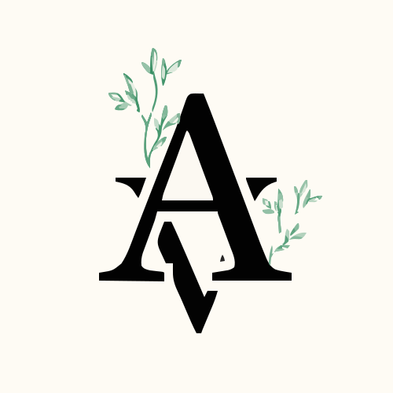

# Define 3.0

The official template repository for Define 3.0


# AyuVritt

> _AI driven bridging gap between ancient wisdom and modern healing._



### Team Information

- **Team Name**: camel_case
- **Track**: AI in AYUSH

### Team Members

| Name            | Role      | GitHub                                             | LinkedIn                                                     |
| --------------- | --------- | -------------------------------------------------- | ------------------------------------------------------------ |
| Aditya S        | Developer | [@xditya](https://github.com/xditya)               | [Profile](https://linkedin.com/in/xditya)                    |
| Akshay Ashok    | Developer | [@aks-hayy](https://github.com/aks-hayy)           | [Profile](https://linkedin.com/in/akshay-ashok-26844224a)    |
| Ann S Binil     | Developer | [@annsbinil](https://github.com/annsbinil)         | [Profile](https://linkedin.com/in/annsbinil)                 |
| Anoushka L Nair | Developer | [@anoushkalnair](https://github.com/anoushkalnair) | [Profile](https://linkedin.com/in/anoushka-l-nair-331b73239) |

## Project Details

### Overview

_We aim to develop an intelligent platform that combines Ayurvedic insights with allopathic analysis to create sustainable AYUSH-based formulations. By validating efficiency and side effects scientifically, the system will enhance the credibility and effectiveness of traditional medicine._

### Problem Statement

_We require a system to generate medicinal knowledge and ayurvedic insights related to allopathy, aiding in the sustainable formulation of AYUSH-based medicine to enhance efficiency and validate it scientifically with proper assessment of side effects._

### Solution

_We intend to build a interface for herbal formulation insights alongside of allopathy analysing and researching on basis of sustainable medicinal development._

### Demo

[](https://www.youtube.com/watch?v=dQw4w9WgXcQ)
_Replace VIDEO_ID with your YouTube video ID or provide an alternative demo link_

### Live Project

[AyuVritt](https://your-project-url.com)

## Technical Implementation

### Technologies Used

- **Frontend**: Next.js
- **Backend**: Node.js
- **Other Tools**: Pretrained models (Bert, Kaggle)

### Key Features

- Medicine formulation analysis.
- Ayurvedic insights connected with allopathic medicine.
- Side effects analysis.

## Setup Instructions

### Prerequisites

- Python 3.10
- Node.js

### Installation

### Clone

```bash
git clone https://github.com/xditya/camel_case
cd camel_case
```

#### Backend

```bash
cd api
pip install -r requirements.txt
python main.py
```

#### Frontend

```bash
cd ..
cd ayuvritt
npm install
npm run dev
```

## Additional Resources

### Project Timeline

| SL NO. | TIME               | WORK DONE                                                                                                                                                                                                                  |
| ------ | ------------------ | -------------------------------------------------------------------------------------------------------------------------------------------------------------------------------------------------------------------------- |
| 1      | 11:00 am - 1:00 pm | • Finalized the problem statement and completed initial analysis.<br>• Designed the product name and logo.<br>• Trained the model to translate local slang for medical symptoms.<br>• Developed the frontend landing page. |
| 2      | 2:00 pm - 5:30pm   | • Developed and optimized website functionality.<br>• Cleaned and preprocessed datasets.<br>• Translated Sanskrit texts to English.                                                                                        |
| 3      | 6:00 pm - 9:00 pm  | • Processed and modified datasets.<br>• Mapped yoga asanas to symptoms.                                                                                                                                                    |
| 4      | 10:30 pm -12:30 am | • Designed naturopathy routines.<br>• Created a naturopathy bucket list.                                                                                                                                                   |
| 5      | 1:00 am – 8:00 am  | • Hosting mindfulness events.<br>• Created "Rising Tree" for chakra focus.<br>• Integrated beauty and wellness practices.<br>• Mapped meditation techniques to symptoms.                                                   |
| 6      | 8:45 am – 11:00 am | • Finalized the product.<br>• Held group discussions.<br>• Submitted related works.                                                                                                                                        |

### Challenges Faced

_Sleep deprivation_

### Future Enhancements

_Customised fine tuned datasets for better results_

---

### Submission Checklist

- [x] Cover Image
- [ ] Completed all sections of this README
- [ ] Added project demo video
- [ ] Provided live project link
- [x] Ensured all team members are listed
- [x] Included setup instructions
- [ ] Submitted final code to repository

---

© Define 3.0 | [Define 3.0](https://www.define3.xyz/)
